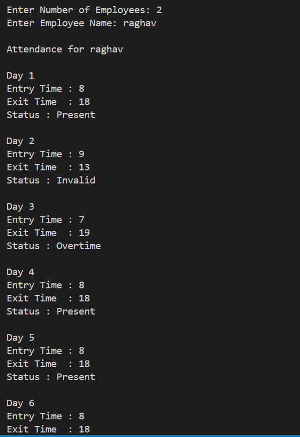
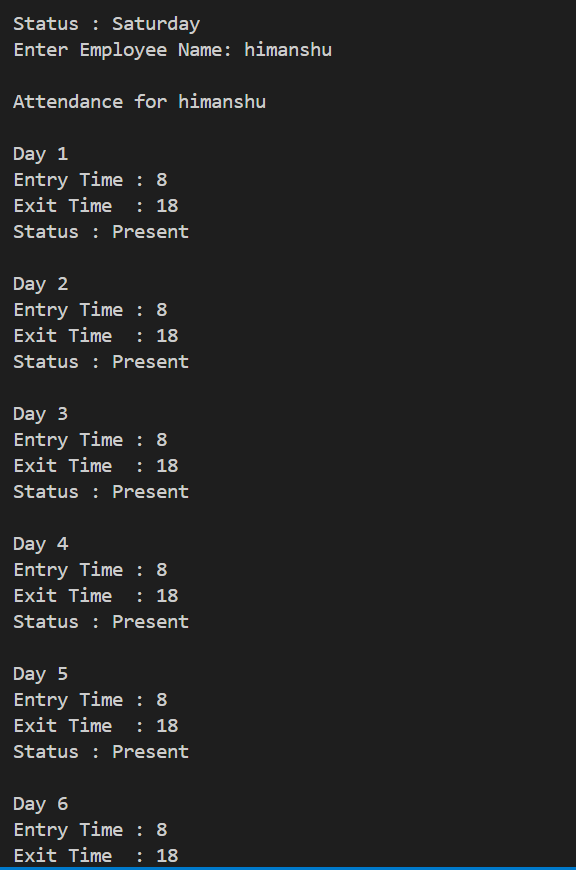
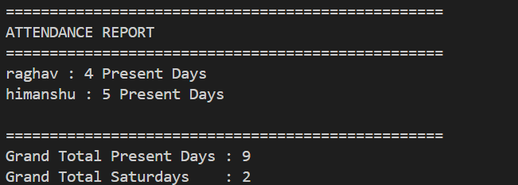

#  Attendance Management System

##  Project Overview
This is a Python-based **Attendance Management System** that tracks employee attendance using entry and exit times.  
The system classifies attendance into:
- Present
- Overtime
- Half Day
- Short Day
- Invalid
- Saturday

It also generates a final attendance report for all employees.

---

##  Features
- Employee-wise attendance tracking
- Daily entry and exit time input
- Automatic attendance classification
- Exception handling for invalid inputs
- Object-Oriented Programming (OOP)
- Final summary report generation

---

##  Technologies Used
- Python 3

---

## 📂 Project Structure
attendance-management-system/
│
├── attendance.py
├── README.md
└── images/
├── output1.png
├── output2.png
└── output3.png

---

##  How to Run

bash
python attendance.py

##  Output Screenshots

### Employee Input

### Attendance Processing

### Final Report

##  Future Improvements
- Add database support (MySQL / SQLite)
- Export attendance report to CSV
- GUI version using Tkinter
- Login system for employees

##  Author
Lakshmi Chauhan
